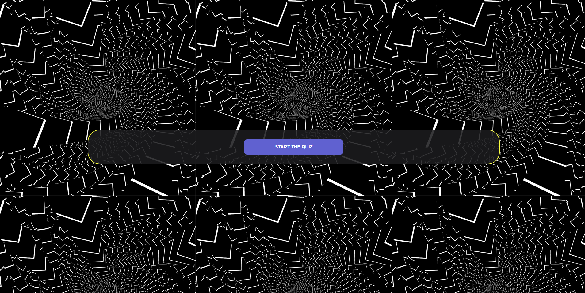
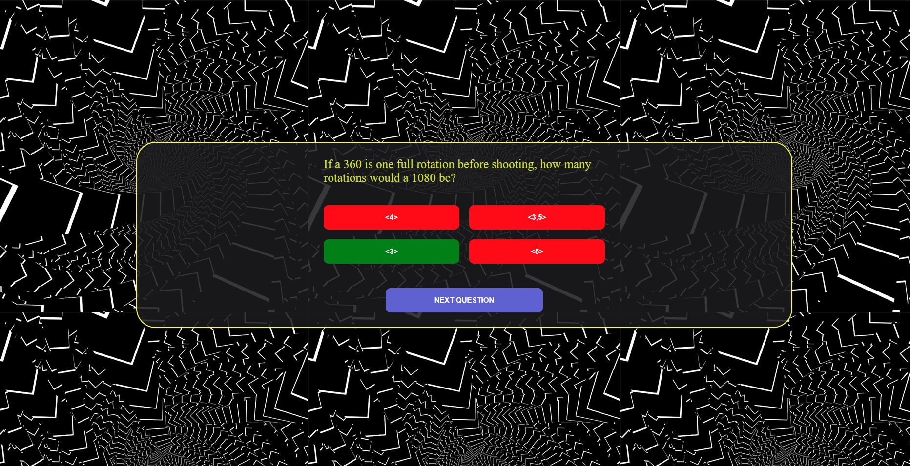
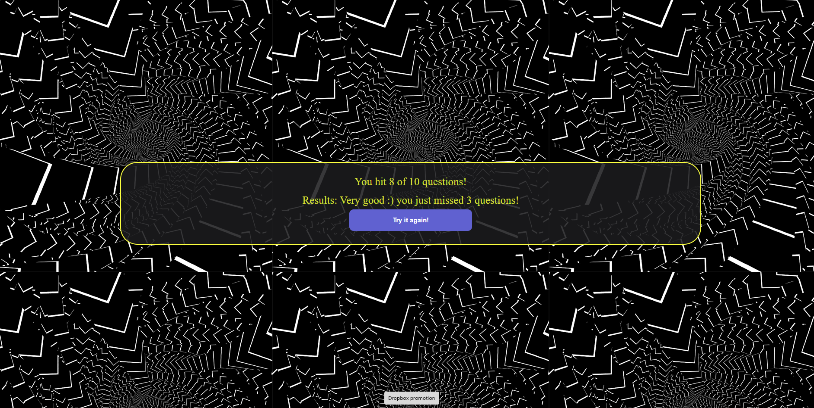
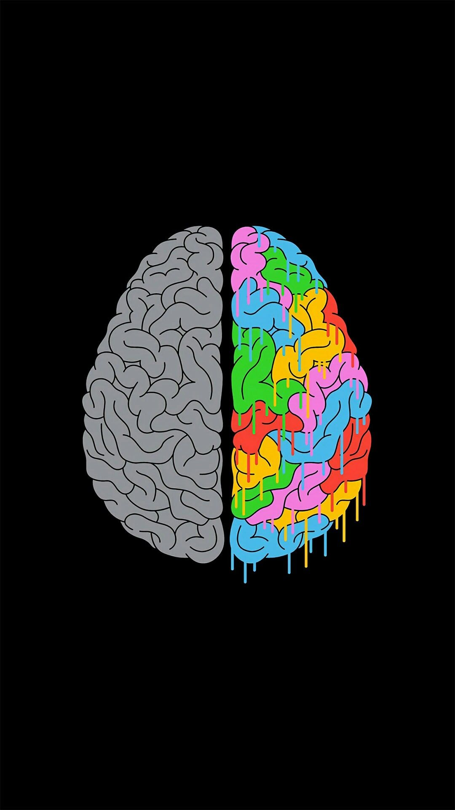

<h1 aligh="center"> </h1> 

<h1>
   </img>
  
  </h1> 

  # Deployed to Vercel ⬇️

https://proyecto-quiz.vercel.app/

# 🖊️ Que es lo que hace ese proyecto? 

-- 

**QUIZ GAME** : Preguntas de nivel medio, al final te dirá el resultado de cuantas preguntas acertaste! No se preocupe si no lo hace bien, ¡Usted puedes hacerlo de nuevo el Quiz!


# 🤓 Proyecto QUIZ:

El proyecto es un juego QUIZ , en el que puedes poner a prueba tus conocimientos. ¡Experiencia muy chula, porque pude aprender más y más! ¡Muchas horas de estudio, sigamos trabajando para mejorar cada vez más!

## 🚀 Lo que se utilizó en este proyecto:

- [JavaScript](https://developer.mozilla.org/es/docs/Web/JavaScript)
- [Css](https://developer.mozilla.org/es/docs/Web/CSS)
- [Html](https://developer.mozilla.org/es/docs/Web/HTML)
- [Funciones Flecha](https://developer.mozilla.org/es/docs/Web/JavaScript/Reference/Functions/Arrow_functions)
- [API](https://opentdb.com/api_config.php)


##  👩‍💻 Como descargar el proyecto

```bash
 # Clonar el repositorio
 $ git clone https://github.com/victorcodigos/proyecto-quiz
 
 # Entrar en el diretorio
 $ cd proyecto-quiz

 # Instalar as dependencias
 $ yarn install

 # Iniciar o proyecto
 $ yarn start


```

## Te mostrará la respuesta correcta después de enviar la respuesta, ¡Ojo! Solo se permite seleccionar una vez.


<h1 aligh="center"> </h1> 

<h1>
   </img>
  
  </h1> 


--

## ⚙️ ¿Qué es un quiz?

--


Se trata de una dinámica o juegos donde los estudiantes eligen la respuesta correcta entre varias preguntas en una lista determinada. Digamos que esta es la forma básica de la herramienta.

Sin embargo todo esto puede variar dependiendo del profesor y de las necesidades que tengan los alumnos. Hay muchas variables que se pueden aplicar en este método.

--

## 😉 ¿Hace cuánto que se utiliza?

--

Este método se lleva utilizando desde hace varios años. Calculamos que bien entrado el siglo XX los profesores se percataron de la necesidad de crear diferentes maneras de evaluar a sus estudiantes para verificar los  conocimientos que tenian sobre un tema determinado.

Es así como a través de preguntas se fueron creando distintos modelos que hasta el día de hoy se  siguen utilizando. El alumno debe leer detenidamente los enunciados y elegir las respuestas que crea pertinente.

## ¿Ventajas de un quiz?

Veamos a continuación algunas ventajas que tenemos al aplicar un quiz:

--

## Rápido: 
-- 

Podemos utilizarlo rápidamente sin hacer muchos preparativos, a diferencia del examen que requiere un protocolo más grande.

## Informal:

--

Es una evaluación menos formal, colocándole una percepción distinta al estudiante y estimulando a que apruebe siempre y cuando tenga los conocimientos.

## Versátil: 

--

Una de las grandes ventajas de un quiz es que se puede emplear de múltiples maneras. Podemos combinarla con diferentes elementos para darle un toque especial y estimular a la 
inteligencia e imaginación de los que están sentados en sus escritorios.

## ¿Es recomendable aplicar un quiz?

--

Por supuesto que es recomendable aplicar este método en tu grupo. Sólo debes utilizar tu intuición y profesionalidad para detectar cuál es el momento adecuado para poder aplicarlo. 


##  Le mostrará el resultado final una vez que haya terminado, ¡Puede volver a hacerlo si lo desea!

<h1 aligh="center"> </h1> 

<h1>
   </img>
  
  </h1> 

## Conclusión: 

-- 

El quiz es un método que lleva muchos años usándose en diferentes pizarras en todo el mundo. Se ha demostrado que da muchos más resultados que otros métodos evaluativos.

Uno de los aspectos más importantes es cómo se sientes los estudiantes ante una prueba de estas. Los estudios demuestran que se sienten mucho más entusiasmados, animados y sin tanto temor que con un examen o exposición. El subconsciente les juega a su favor y hace que tengan un mayor rendimiento, siendo positivo para ambas partes.

Si estas pensado en utilizar un quiz en tus clases, definitivamente es una gran decisión. No lo dudes más y aplícalo ya para que veas todos los resultados que tendrás.

Si quieres opiniones, pasate por la web de mejores opiniones.

--


## 🔗 Enlace para la presentacion

[Click aqui](https://github.com/victorcodigos/proyecto-quiz)


<h1 aligh="center"> </h1> 

<h1>
   </img>
  
  </h1> 

